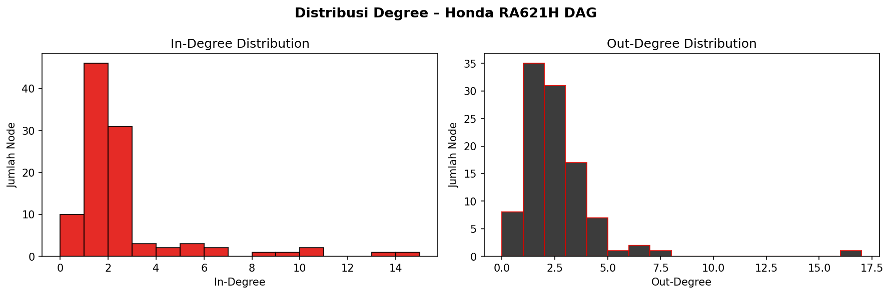

<div align="center">
  

  <h1>dag-and-cpm-implementation-for-f1-honda-ra621h-assembly-scheduling</h1>
  <p><strong>Directed Acyclic Graph (DAG) and Critical Path Method (CPM) for Formula 1 Power Unit Assembly Scheduling</strong></p>

  <p align="center">
    
    
    
    
    
  </p>

  <p align="center">
    A comprehensive graph-theoretic modeling and scheduling framework that analyzes the multi-stage assembly dependencies of the Formula 1 Honda RA621H power unit using Kahn's topological sort, Critical Path Method (CPM), and an interactive Pyodide WebAssembly client dashboard.
  </p>
</div>

## Tech Stack


## Overview

The assembly of a modern Formula 1 hybrid power unit, such as the championship-winning Honda RA621H (1.6L V6 Turbo Hybrid), represents a manufacturing challenge involving hundreds of tightly coupled components, structural constraints, and strict temporal dependencies.

This repository models the complete assembly hierarchy as a Directed Acyclic Graph (DAG), verifying acyclicity and deriving parallelizable assembly stages via Kahn's breadth-first topological sorting algorithm. It further executes the Critical Path Method (CPM) through forward and backward passes to identify the bottleneck sequence of operations, calculate task slack (total float), and determine the minimum total build time.

An interactive browser dashboard running Pyodide (Python compiled to WebAssembly) allows step-by-step playback of topological wave discovery, interactive SVG graph navigation, and live pandas-based subsystem metrics aggregation without requiring backend services.

## Verified Core Capabilities

- Graph Ingestion and Verification: Converts structured Excel component definitions and dependency matrices into NetworkX directed graph representations, validating directed acyclic properties.
- Topological Sort Execution: Implements Kahn's Algorithm in $O(V + E)$ time complexity to group independent components into parallel execution waves.
- Critical Path Method (CPM) Engine: Computes Earliest Start (ES), Earliest Finish (EF), Latest Start (LS), Latest Finish (LF), and Total Float for all 103 engine components.
- Subsystem Analytics: Evaluates mean duration, total hours, degree centrality, and critical path concentration across 19 power unit subsystems.
- Zero-Backend Interactive Web Dashboard: Provides browser-based execution with Pyodide WebAssembly, step-by-step Kahn playback, SVG network visualization, and Gantt-style timeline inspection.
- Academic Research Artifacts: Includes final technical reports, presentation decks, and published literature covering activity network theory and assembly balancing.

## Mathematical Formulations

### 1. In-Degree and Kahn's Topological Sorting

Let $G = (V, E)$ be a directed graph where $V$ denotes the set of assembly tasks and $E \subseteq V \times V$ represents directed precedence constraints. The in-degree of task $v \in V$ is defined as:

$$
\text{in-degree}(v) = |\{ u \in V \mid (u, v) \in E \}|
$$

The algorithm initializes a queue $Q = \{ v \in V \mid \text{in-degree}(v) = 0 \}$. In each iteration, a task $u$ is removed from $Q$, appended to the topological sequence, and each outgoing edge $(u, w) \in E$ is removed by decrementing $\text{in-degree}(w)$. If $\text{in-degree}(w)$ reaches 0, $w$ is enqueued into the next parallel wave.

Acyclicity holds if and only if the number of sorted vertices equals $|V|$:

$$
|V_{\text{sorted}}| = |V| \iff G \text{ is a valid DAG}
$$

### 2. CPM Forward Pass (Earliest Times)

Let $D(v)$ represent the positive duration of task $v$, and $\text{Pred}(v) = \{ u \in V \mid (u, v) \in E \}$ be the set of immediate predecessor tasks.

The Earliest Start time $\text{ES}(v)$ and Earliest Finish time $\text{EF}(v)$ are computed in topological order:

$$
\text{ES}(v) = \begin{cases} 0 & \text{if } \text{Pred}(v) = \emptyset \\ \max_{u \in \text{Pred}(v)} \text{EF}(u) & \text{otherwise} \end{cases}
$$

$$
\text{EF}(v) = \text{ES}(v) + D(v)
$$

The minimum total project completion time $T_{\text{project}}$ is:

$$
T_{\text{project}} = \max_{v \in V} \text{EF}(v)
$$

### 3. CPM Backward Pass (Latest Times)

Let $\text{Succ}(v) = \{ w \in V \mid (v, w) \in E \}$ denote the set of immediate successor tasks.

The Latest Finish time $\text{LF}(v)$ and Latest Start time $\text{LS}(v)$ are computed in reverse topological order:

$$
\text{LF}(v) = \begin{cases} T_{\text{project}} & \text{if } \text{Succ}(v) = \emptyset \\ \min_{w \in \text{Succ}(v)} \text{LS}(w) & \text{otherwise} \end{cases}
$$

$$
\text{LS}(v) = \text{LF}(v) - D(v)
$$

### 4. Total Float and Critical Path Identification

The Total Float (slack) $\text{Float}(v)$ represents the maximum time task $v$ can be delayed without extending the total project duration:

$$
\text{Float}(v) = \text{LS}(v) - \text{ES}(v) = \text{LF}(v) - \text{EF}(v)
$$

The Critical Path consists of all tasks with zero total float:

$$
\text{Critical Path} = \{ v \in V \mid \text{Float}(v) = 0 \}
$$

Any delay in a task on the critical path directly increases the overall build duration.

## Honda RA621H Dataset Profile

The dataset models the complete modular architecture of the Honda RA621H Formula 1 Power Unit:

- Total Components (Nodes): 103 items
- Total Dependency Constraints (Edges): 216 relations
- Initial Root Components: 16 tasks with in-degree = 0
- Modeled Subsystems (19 Total):
  - Internal Combustion Engine (ICE V6 1.6L Turbo Hybrid)
  - Turbocharger Assembly and Compressors
  - Hybrid Motor Generator Units (MGU-H and MGU-K)
  - Energy Store (ES Lithium-Ion Battery Pack)
  - Lubrication, Cooling, and Fuel Distribution Systems
  - Electronic Control Units (ECU) and Wire Harnesses
  - Carbon-Fiber Reinforced Polymer (CFRP) Chassis and Monocoque
  - Front and Rear Suspension Geometries
  - Aerodynamic Elements (Front and Rear Wings, Floor, Diffuser)
  - 8-Speed Seamless-Shift Gearbox and Drivetrain
  - Carbon-Carbon Braking Hydraulics
  - Cockpit Safety Structures and Titanium Halo
  - Final Quality Assurance and Dyno Sign-Off

## System Architecture and Execution Pipeline

The analytical and visualization workflow is partitioned into four distinct stages:

1. Data Partitioning and Normalization:
   The raw spreadsheet (`data/Honda_RA621H_Assembly_Dataset.xlsx`) is ingested by `src/partition_dataset.py`, extracting normalized tables for components, dependency edges, and summary metrics into `results/output_csv/`.

2. Graph Computation and Jupyter Notebook Analysis:
   `notebooks/Notebook_Honda_RA621H_DAG_Kahn_CPM.ipynb` builds the NetworkX graph model, verifies DAG properties, computes topological waves, runs CPM passes, and outputs high-resolution distribution charts to `results/graph/`.

3. Client-Side WebAssembly Simulation:
   The web application in `web/` loads `web/data/components.json` and initializes Pyodide to execute `web/py/cpm_kahn.py` inside the browser's WebAssembly sandbox.

4. Interactive Visualization Interface:
   `web/index.html` and `web/js/main.js` render interactive SVG network diagrams, critical path highlights, component inspection drawers, and step-by-step topological sort step animations.

## Repository Structure

- `requirements.txt`: Python package dependency specifications.
- `LICENSE`: MIT open source license terms.
- `data/`: Raw dataset repository.
  - `data/Honda_RA621H_Assembly_Dataset.xlsx`: Comprehensive multi-sheet assembly workbook.
- `src/`: Data processing utilities.
  - `src/partition_dataset.py`: Cross-platform Excel to CSV extraction script.
- `notebooks/`: Exploratory and modeling notebooks.
  - `notebooks/Notebook_Honda_RA621H_DAG_Kahn_CPM.ipynb`: Complete DAG, Kahn, CPM, and statistical pipeline.
  - `notebooks/Notebook_DAG_Progress.ipynb`: Incremental development and exploratory experiments.
- `web/`: Client-side WebAssembly visualization dashboard.
  - `web/index.html`: Main user interface with 3-tab layout (CPM and DAG, Pandas Stats, Kahn Step Replay).
  - `web/css/style.css`: Formula 1 dark theme and responsive layout styling.
  - `web/js/main.js`: UI controllers, SVG graph renderer, and Pyodide communication bridge.
  - `web/py/cpm_kahn.py`: Pure Python CPM and Kahn engine running inside Pyodide.
  - `web/data/components.json`: Component catalog with dependency indices and metadata.
- `results/`: Computed model outputs and graphics.
  - `results/graph/`: Generated high-resolution graph visualizations and degree distributions.
  - `results/output_csv/`: Exported component tables, edge lists, and summary statistics.
- `docs/paper/`: Academic papers, project reports, and presentation slide decks.
- `archive/`: Legacy prototypes and previous implementation iterations.

## Prerequisites and Environment Setup

### Prerequisites

- Python 3.8 or higher.
- Modern Web Browser (Chrome, Firefox, Edge, or Safari) with WebAssembly and Web Workers support.

### Environment Setup

1. Clone the repository:

   ```bash
   git clone https://github.com/your-username/dag-and-cpm-implementation-for-f1-honda-ra621h-assembly-scheduling.git
   cd dag-and-cpm-implementation-for-f1-honda-ra621h-assembly-scheduling
   ```

2. Create and activate a virtual environment:

   On Windows (PowerShell):
   ```powershell
   python -m venv .venv
   .venv\Scripts\Activate.ps1
   ```

   On Linux/macOS:
   ```bash
   python3 -m venv .venv
   source .venv/bin/activate
   ```

3. Install required Python packages:

   ```bash
   pip install -r requirements.txt
   ```

## Usage and Execution Workflows

### 1. Partition Dataset (Optional)

To regenerate the CSV exports from the primary Excel workbook:

```bash
python src/partition_dataset.py
```

Output files will be written to `results/output_csv/`.

### 2. Running the Analytical Notebook

Launch JupyterLab or Jupyter Notebook:

```bash
jupyter notebook notebooks/Notebook_Honda_RA621H_DAG_Kahn_CPM.ipynb
```

Execute cells sequentially to inspect graph density, compute topological sort sequences, calculate CPM metrics, and save output visualizations.

### 3. Launching the Interactive Web Dashboard

To run the interactive browser application:

```bash
cd web
python -m http.server 8080
```

Open `http://localhost:8080` in your web browser.

Note: While `index.html` can be opened directly, using a local HTTP server ensures that browser cross-origin policies do not restrict local asset fetches or Pyodide package downloads.

## Research References

The theoretical foundation and domain context of this implementation draw from the literature archived in `docs/paper/`:

1. Activity Networks and Project Performance:
   Analysis of stochastic and deterministic activity network topology in complex engineering programs.
2. CPM and PERT Graph Applications:
   Algorithmic principles for solving scheduling and bottleneck identification in precedence networks.
3. Flexible Assembly Line Balancing:
   Multi-objective scheduling optimization methods applied to discrete manufacturing pipelines.

## License

This project is distributed under the MIT License. See the [LICENSE](LICENSE) file for terms and conditions.

